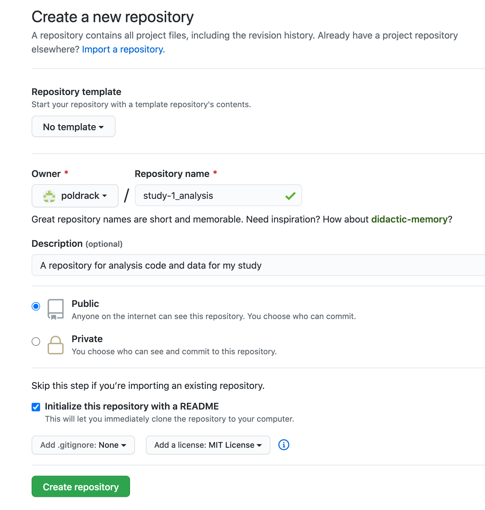
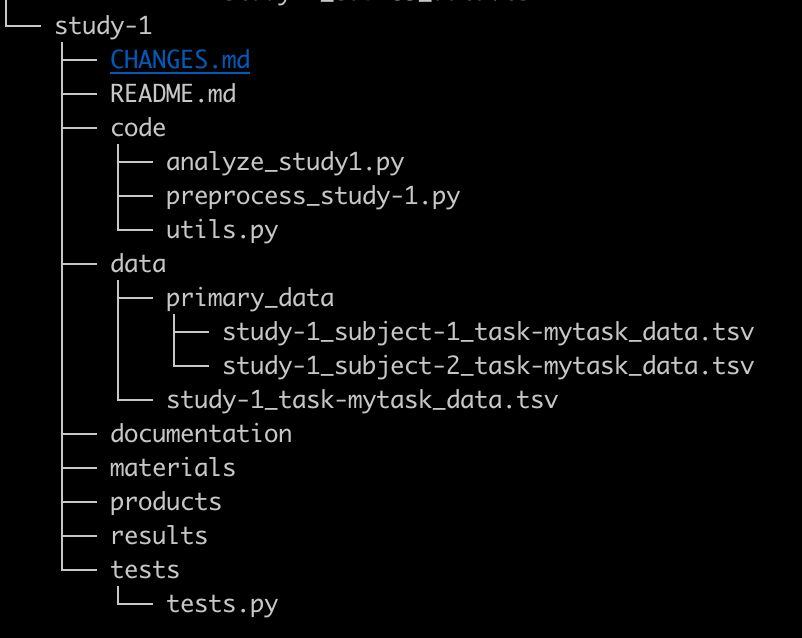

# Code Sharing

## Why share code?

> An article about computational science in a scientific publication is not the scholarship itself, it is merely advertising of the scholarship. The actual scholarship is the complete software development environment and the complete set of instructions which generated the figures. [Buckheit & Donoho (1995)](https://www.google.com/url?q=https://statweb.stanford.edu/~wavelab/Wavelab_850/wavelab.pdf&sa=D&ust=1596213792946000&usg=AOvVaw3xtTF6L7SbwQRVvpCB0zaT)

There is no doubt that science can be hard, and science can be slow. After months and months or years of working on a project, it can be very tempting to just finish it already. When the alternative is to keep working, just to make your code readable and a little more accessible, the choice seems clear. However, there are many solid reasons why you should share your code.

1.  *Sharing your code improves reproducibility.* If someone reads your code and is surprised by the results, they can take your code and immediately run it on your or other data, insteading of having to take the time to estimate your code from scratch using the manuscript, potentially introducing misinterpretations or bugs resulting in different results for non interesting reasons. Please see the [reproducible analyses](https://www.google.com/url?q=https://docs.google.com/document/d/1xQywZPrNDLkGPlsCVhCKT5yWBD-Rko0fGk2pjH_eCng/edit%23heading%3Dh.ls8jlrwpy9vb&sa=D&ust=1596213792947000&usg=AOvVaw3m9og6tI0rICUwNEwYsc_v) section for a larger overview of this case.
2.  *Your code makes things transparent.* It makes many choices explicit that are normally implicit or nonexistent in published manuscripts (How did you clean the data? How did you implement the model? Are there any idiosyncratic choices that went unmentioned previously? Are there assumptions which may not be supported by the literature?).
3.  *Online code supports collaboration.* You are a busy scientist, and in the case that someone wants to reuse/repurpose/extend your code, there can be a large start up cost of time and energy for both you and the potential collaborator to find time to share code and go over how to use it. Making your code available online, organized with READMEs and a license can decrease the overhead on getting a potential collaborator started, speeding up the scientific process.
4. *More eyes on a project can catch more errors.* Errors are bound to happen, whether they come in the form of typos, misordered lines, accidental assumptions, or more insidious forms. Many are caught, but not all. By sharing your code online and making it easy for others to work with, you're increasing your chances that the code is reliably doing what it is supposed to be doing.
5.  *Creating shareable code from the beginning can actually save you time.* Using versioning and other habits of shareable coding can prevent irreparably breaking code, and can help you keep track of the changes you’ve made in the process of creating the code. The most salient example of this occurs when you finally have time to return to project that was put on the back burner months ago (or need to dive back into your code to make adjustments appeasing reviewer \#2) - a disheartening amount of time can be lost reading your old code just trying to figure out  what was I doing? What is that variable and where does it go? When your code has been prepared in a shareable way, you can quickly return to proficiency in using it, making your projects speed up, and making reviewer \#2 much happier.

Many researchers are worried about sharing their code, for various reasons.  However, the sharing of code is becoming increasingly common and even expected in many scientific fields.  As Nick Barnes said in his outstanding piece, “[Publish your computer code: it is good enough](https://www.google.com/url?q=https://www.nature.com/articles/467753a&sa=D&ust=1596213792948000&usg=AOvVaw1J4eDgqpK1dnJg11j9XihF)”:

> That the code is a little raw is one of the main reasons scientists give for not sharing it with others. Yet, software in all trades is written to be good enough for the job intended. So if your code is good enough to do the job, then it is good enough to release — and releasing it will help your research and your field.

Prerequisites
=============

The steps to getting started below assume some basic skills, which are presented in more detail in the Basic Skills section of the guide:

-   Using the command line shell
-   Understanding file systems
-   Understanding version control using git

In addition, see the section on Reproducible Analysis for suggestions on how to write and organize your code and data in a way that enhances reproducibility.

Getting started with code sharing
=================================

Step 1: Set up git and Github
-----------------------------

Git is currently the most popular version control system, and it allows one to easily share code via github.com, which is the most popular online git repository system.


-   Install git on your local computer: [https://git-scm.com/downloads](https://www.google.com/url?q=https://git-scm.com/downloads&sa=D&ust=1596213792950000&usg=AOvVaw14vI3VGNP53JK910BeFgpR)
-   Create an account on Github: [https://github.com/](https://www.google.com/url?q=https://github.com/&sa=D&ust=1596213792951000&usg=AOvVaw24cyY-NlYfJJux3AojI4EP)
-   It will make your life much easier if you set up an SSH key for your local computer and add it to your Github account: This way, you won’t need to enter your github password every time you push code to the repository.  See [this article](https://www.google.com/url?q=https://dev.to/idrisrampurawala/configuring-ssh-for-git-2of1&sa=D&ust=1596213792951000&usg=AOvVaw3yRSRKoznD6SFs15aqL2VF) for more.

Step 2: Choose a license for your code
--------------------------------------

Specifying a license for your code allows you to stipulate how others can re-use the code. In general, you should select the most permissive license possible --- that is, the license that gives the greatest possible freedom for others to reuse the code.


-   MIT License is a good default choice as it allows people to do almost anything with your code, which will maximize its potential reuse
-   If you are going to be collaborating with an existing code base, then it’s best to select the license that they are already using


-   If you need help determining which license is most appropriate for your particular situation, see [https://choosealicense.com/](https://www.google.com/url?q=https://choosealicense.com/&sa=D&ust=1596213792952000&usg=AOvVaw0ytGFb6uBLYYJn-FH2u9Ij)
-   Preventing commercial reuse might sound like a good idea, but in most cases it’s not: [https://freedomdefined.org/Licenses/NC](https://www.google.com/url?q=https://freedomdefined.org/Licenses/NC&sa=D&ust=1596213792952000&usg=AOvVaw019rwVoDeChEpV1BJi4jkK)

Step 3: Create a new repository on Github, and clone it to your computers
-------------------------------------------------------------------------

-   Create a new repository from your Github page (using the menu at the top right with the + sign)

<p align="center"></p>

-   Complete the form to create the new repo, including selecting your license and creating a README file

<p align="center"></p>

-   Once you create the repository, you will be taken to the main page for the repository.  Obtain the link to your repository under the Code tab, and copy it.

<p align="center"></p>

-   On your local computer, clone the github repository using:  ``git clone \<link copied from github page\>``
-   This will create a new directory on your computer with the same name as your github project.
-   Note: Some editors, such as RStudio and Visual Studio Code, allow one to directly connect to github within the editor; see below for more details.

Step 4: Organize your code
--------------------------

The main goal of organizing your code is to make it clear to you and to others where to find the different parts of your project.  See the additional guidance in the section on Reproducible Analysis for how to write code that is clear and readable.

Regardless of the particular scheme that you use to organize and name your files, you should use the same scheme for all of your projects.  This will make it easier for you to find things and remember what you've done in the future.  Different languages have different conventions about how to structure the code; the most important thing is that you follow common conventions when they exist, and that you are consistent in your own work.

Some researchers include data within their code directory; see the section on Data Sharing for more on the issue of how to organize and share data.

For example, if you were creating a new project called study-1 and decided to include the data in the same directory as the code, you might structure the directory as follows, following to the [Psych-DS](https://www.google.com/url?q=https://docs.google.com/document/d/1u8o5jnWk0Iqp_J06PTu5NjBfVsdoPbBhstht6W0fFp0/edit%23heading%3Dh.1f1h1ilgqcg&sa=D&ust=1596213792955000&usg=AOvVaw3JK-wAbCxGN_foxsPOKgqf) and [Project Tier](https://www.google.com/url?q=https://www.projecttier.org/tier-protocol/specifications/%23overview-of-the-documentation&sa=D&ust=1596213792955000&usg=AOvVaw2iNQ9eY88GzwLnu989lNKx) frameworks:

<p align="center"></p>


Step 5: Commit your code to the local repository
------------------------------------------------

As you write your code, commit it to the repository. First, you need to add it to the staging area:

-   ``git add \<filename\>``

Then you commit it, providing a message that describes the changes you have made.

-   ``git commit -m ”\<a message describing the commit\>”``

You should commit your code regularly.  For example, any time you add a new function or a new section to your code, you should commit. The commit history allows you to look back and see what you have done, and also allows you to reverse changes that you have made.

Step 6: Push your changes to Github
-----------------------------------

To push your changes back to the repository on Github, use the following command:

-   ``git push origin master``

This tells git to push the changes that you have committed to the repository on github (which by default is labeled as origin), into the branch called master (don’t worry about branches just yet).  

Step 7: Push your code to the repository
----------------------------------------

-   You will first need to pull the files that were created when the repository was created, such as the License file:

    -   ``git pull origin master``

-   You can then push your files to the remote repository:

    -   ``git push origin master``

When you are ready to publish your work:
========================================

Step 1: Create a release
------------------------

When you are ready to save a fixed version of the code (for example, when you submit a paper), you can create a release.  See [the github guide to creating a release](https://help.github.com/en/github/administering-a-repository/managing-releases-in-a-repository\#creating-a-release) for instructions on how to do this.

Step 2: Create a citable identifier for your release
----------------------------------------------------

In order to make your code citable, it is useful to have a digital object identifier (DOI) for your code. You can create these easily by linking your github repository to Zenodo.org. Then, any time a release is created on github, it will be deposited to Zenodo and a new DOI will be created. See [the github guide to citeable code](https://guides.github.com/activities/citable-code/) for instructions on how to set this up.  This has the benefit of allowing one to cite a specific version of the code used at a particular point in the project (e.g. upon submission of the manuscript), which enhances reproducibility.

Frequently Asked Questions
==========================

What is a “repository”?
--------------------------------------------------------------
By “repository” we mean a folder that is dedicated to a specific project, containing both the data and code for that project, which is under version control (e.g. using git).  

- It’s generally best practice to place all of these within a folder on your filesystem, so that they can be separated out from other kinds of documents and you can easily find them (such as “Dropbox/code”).  
- It’s also a good idea to place them within a location that will be backed up by whatever cloud service you use (Dropbox, Google Drive, Box, etc), so you have an extra backup in addition to your remote code repository


What is a license, and how should I choose one for my project?
--------------------------------------------------------------

Software licenses describe the rights and responsibilities of users of your code from two perspectives: developers and end-users. An end-user is anybody who uses any software that includes your code. A developer is somebody who writes additional code, either by modifying your code or by including some portion of your code in a larger project.

The software license is generally stored in full in the base directory of the repository, either in a LICENSE or COPYING file.

Assuming you would like your code to be reused, you will likely prefer a [free or open-source software](https://www.google.com/url?q=https://en.wikipedia.org/wiki/Free_and_open-source_software&sa=D&ust=1596213792962000&usg=AOvVaw2enLEt-WXh1MuktvmbVZnF) license, any of which will grant broad permissions to copy, reuse and remix your code in the context of other projects. A useful resource for finding the right license for your code is [ChooseALicense.com](https://www.google.com/url?q=https://choosealicense.com/&sa=D&ust=1596213792962000&usg=AOvVaw284wE8jGYg-P029EzGxBCU).

Apart from the specific terms of each license, the most significant thing to consider is license compatibility, or the ability to combine code released under different licenses. There are extensive discussions over licensing and what is the best license for sharing code, but in practice the license to choose is the common license among the community where your code fits best. For example, the MIT and Apache 2 licenses are very common in the Neuroimaging in Python (Nipy) community, making these pragmatic choices for neuroimaging tools written in Python. If you are writing code that fits into a community where the GPL is prevalent, the Free Software Foundation maintains a [list of licenses](https://www.google.com/url?q=https://www.gnu.org/licenses/license-list.html&sa=D&ust=1596213792963000&usg=AOvVaw0JBaz-70na-8SmSZjE3vOL) and their compatibility.

Less common for software but increasingly common for textual content like documentation are the [Creative Commons](https://www.google.com/url?q=https://creativecommons.org/&sa=D&ust=1596213792963000&usg=AOvVaw0Pi0ITqsg9Uv-xiJyI9Yjz) family of licenses. They also provide a tool for [selecting a license](https://www.google.com/url?q=https://creativecommons.org/choose/&sa=D&ust=1596213792963000&usg=AOvVaw2CArom0FbN8ySAHwViGD8i).

Note that there is very little case law on open-source licenses. Licenses are mostly a statement of principles, and all of the baroque behavior around them, such as avoiding mixing “incompatible” licenses, has little to no legal basis.

Should I include a non-commercial limitation in my license?
-----------------------------------------------------------

Many open licenses include a non-commercial clause, such as that in the Creative Commons [NonCommercial suite of licenses](https://www.google.com/url?q=https://creativecommons.org/licenses/by-nc/4.0/legalcode&sa=D&ust=1596213792964000&usg=AOvVaw332OADBzkD7_6C6jaTV2KU):

NonCommercial means not primarily intended for or directed towards commercial advantage or monetary compensation. For purposes of this Public License, the exchange of the Licensed Material for other material subject to Copyright and Similar Rights by digital file-sharing or similar means is NonCommercial provided there is no payment of monetary compensation in connection with the exchange.

The intent of such clauses is to prevent private companies from exploiting the labor of the author(s) as an alternative to hiring an author or purchasing the content. This in turn makes the prospect of contributing free labor to a project more appealing by making it less likely that the contributors’ work will be repurposed in this way.

It is, however, unclear whether a non-commercial license prevents a for-profit company from using the material in any capacity, or if the restriction applies to processes that lead to commercial activity, or more strictly as a component of a product to be sold. This ambiguity can lead to for-profit entities avoiding any software that might contain such a provision, to avoid legal exposure.

The use of these licenses can thus reduce the adoption of a particular tool within a significant segment of the scientific community, working against goals of standardization, and thus reproducibility.


What is a “branch” and how can I use them?
------------------------------------------

A branch is a chain of git commits, which represents the evolution of a repository. Each repository will have a canonical branch, usually called “master”. By looking at “master” at any given time, you can see the current state of the repository and the chain of commits that produced this state. Other branches may be used as an organizational tool by separating chains of commits according to particular tasks.

When developing, it is frequently useful to make commits before they are ready to be included in the “official history”. For example, when fixing a bug, a common pattern is to create a new branch, write a test that demonstrates the bug, and then fix the bug:

1.  Retrieve the latest state of the repository from the server and create a branch based on the latest commit on master. The “origin” remote is used here, but if contributing to somebody else’s repository, consider using “upstream” (see the next section to set up upstream).
    - ``git fetch origin``
    - ``git switch -C fix-bugXYZ origin/master``
1.  Create a new test, and verify that the tests fail. This is a bit more free-form.
2.  Commit the changes and push to the server. This announces to collaborators what you’re working on. If your server has continuous integration tests, it will simplify evaluation. This is also when to open a pull request (see next section). The -u flag ensures that future calls to git push/git pull will associate the local fix-bugXYZ branch and the remote origin/fix-bugXYZ:
    - ``git add path/to/test``
    - ``git commit -m “TEST: Reproduce bug XYZ; tests fail”``
    - ``git push -u origin fix-bugXYZ``
1.  Resolve the bug, and verify that the tests pass.
2.  Commit and push the changes. Since we used the -u flag above, we can simply use git push here:
    - ``git commit -m “FIX: Make ABC change to fix bug XYZ; tests pass”``
    - ``git push``

Pushing to a remote branch allows collaborators to inspect the changes. If you’re using automatic testing on the remote, the test failure and resolution become easily verifiable prior to inclusion in the master branch.

The same principle applies for new features or other modifications. This is also useful for more exploratory changes that may never be included in the master branch, and makes explicit the process of resolving conflicts, if two developers are working on different components simultaneously.

What is a “pull request” and how can I use them to collaborate?
---------------------------------------------------------------

A pull request is a way to request that code from a particular branch or fork be integrated (“pulled”) into another branch.  A common model for collaborative development would be as follows.  Let’s say that one researcher (A) has developed a project called analysisXYZ, and another researcher (B) wants to add a new feature to that project.  The steps would be:

1.  Researcher B would create a fork of this project, which is basically a copy of the project that lives separately in Researcher B’s github account, and clone this fork onto their local computer.
2.  In order to be able to keep the fork up to date with the original repository, Researcher B would create a new remote in their local version of the fork, usually called “upstream”:
    - ``git remote add upstream \<link to original repo\>``
1.  Researcher B would modify the code in their fork to add the new feature, commit the changes.
2.  Prior to making any changes, the upstream remote should be fetched to ensure that changes are made to the latest state, reducing the chance for conflict:
    - ``git fetch upstream``
1.  Changes should almost always be made on a new branch, diverging from the master branch on the upstream remote. Working on the master branch is strongly discouraged. It is good practice to use a short but descriptive branch names, for example, fix-bugXYZ.
    - ``git switch -C fix-bugXYZ upstream/master``
1.  Researcher B pushes their changes back to the github repository of their fork (remote origin), specifying the branch (for example, fix-bugXYZ):
    - ``git push -u origin fix-bugXYZ``
1.  Researcher B goes to the github page for their fork, selects the pull requests tab, and creates a new pull request, which will encompass all of the changes that have been committed.  The pull request description should be as detailed as possible.
2.  Researcher A reviews the pull request, and makes suggestions for changes.  Once they are satisfied with the request, they merge the request, which integrates the changes into the master branch on the original repo.

How can I push an existing repository on my computer to github?
---------------------------------------------------------------

Your github repository is treated as a remote repository by your local computer.  When you clone a repository from github, the remote is automatically generated and given the name origin.  Sometimes you might wish to add a remote for an existing repository on your computer, as when you have an existing local git repo and you wish to link it to a new repository on github.

-   Within your code directory, add a remote repository, which we will call origin:
    -   ```git remote add origin \<link to your repo\>```
-   You can obtain the link to the repo from the green button marked “Clone or download” on your Github repository page. Be sure that is says “Clone with SSH”; if not, then first click the “Use SSH” button in the window.  The link should look like ``“<git@github.com>:\<your name\>/\<repository name\>.git”``

Should I share my data in the same repository with my code?
------------------------------------------

If one’s data are relatively small it is common to share them along with the code within the same repository.  However, if the data are relatively large (say tens of megabytes or larger) then one would usually store and share them separately from the code.  See the section on Data Sharing for more details on how to share data.

How can I share my entire software environment?
-----------------------------------------------

The environment refers to the full set of software (including libraries and other dependencies, sometimes including the operating system) that are used when the code is executed.  See the section on Reproducible Analysis for more on why sharing environments is important.

[Anaconda](https://www.google.com/url?q=https://www.anaconda.com/&sa=D&ust=1596213792971000&usg=AOvVaw2WYGIMHbe2aV5yrzaFvjRw) is a package management for Python and R that allows one to create multiple “virtual environments” that are easy to switch between. Thus, for example, if you wanted to build a specific project using a particular older version of a software library, you could build a virtual environment including that version, while still being able to use the newer version within a different virtual environment.  The [Anaconda documentation on managing environments](https://www.google.com/url?q=https://docs.conda.io/projects/conda/en/latest/user-guide/tasks/manage-environments.html&sa=D&ust=1596213792971000&usg=AOvVaw2IMX9rEtn1vSOX6kNcwJtl) provides detailed information about how to export and share details about a virtual environment.

[Docker](https://www.google.com/url?q=https://docs.docker.com/&sa=D&ust=1596213792972000&usg=AOvVaw3WWtcNOMIQ8PxpYYjmz_aa) is a system for generating a container that defines all of the software dependencies necessary to execute a particular program.  The contents of the container are defined using a Dockerfile, which can be shared to allow others to recreate the container exactly. In addition to sharing the Dockerfile, it is also possible to share the entire container using the [DockerHub](https://www.google.com/url?q=https://hub.docker.com/&sa=D&ust=1596213792972000&usg=AOvVaw1EPG7aecNQhyf1NWTo1_-0) web site. The section on Reproducible Analysis provides much more detail on using Docker.  

How can I use git within my code editor?
----------------------------------------

-   RStudio:
    -   [Using Git within RStudio](https://cfss.uchicago.edu/setup/git-with-rstudio/)
    - [Using Version Control with RStudio](https://support.rstudio.com/hc/en-us/articles/200532077-Version-Control-with-Git-and-SVN)


-   Visual Studio Code
    -   [Using git with VS Code](https://code.visualstudio.com/docs/editor/versioncontrol)

Background Resources:
=====================

On code sharing:
----------------

-   [Publish your computer code: It is good enough.](https://www.google.com/url?q=https://www.nature.com/articles/467753a&sa=D&ust=1596213792974000&usg=AOvVaw0u6eAaKegYpbZBS5elRxvr)
-   [Towards standard practices for sharing computer code and programs in neuroscience](https://www.google.com/url?q=https://www.ncbi.nlm.nih.gov/pmc/articles/PMC6386137/&sa=D&ust=1596213792975000&usg=AOvVaw17BU4xS3FqnSicyeR7A52v)
-   

On licensing and Free/Open Source Software:
-------------------------------------------

-   [History of the Open Source Initiative](https://www.google.com/url?q=https://opensource.org/history&sa=D&ust=1596213792975000&usg=AOvVaw2e69-qFXa2U6PlELxQpkRn). Website.
-   Morozov, E. 2013. [The Meme Hustler](https://www.google.com/url?q=https://thebaffler.com/salvos/the-meme-hustler&sa=D&ust=1596213792975000&usg=AOvVaw1h6FEyEPX9NmkPaLfFYGyp). The Baffler.
-   Klabnik, S. 2019. [The Culture War at the Heart of Open Source](https://www.google.com/url?q=https://words.steveklabnik.com/the-culture-war-at-the-heart-of-open-source&sa=D&ust=1596213792976000&usg=AOvVaw3NAQPpOeVt1sY8TbGSDlKy). Blog.
-   [The case for Free use: reasons not to use a Creative Commons -NC license](https://www.google.com/url?q=https://freedomdefined.org/Licenses/NC&sa=D&ust=1596213792976000&usg=AOvVaw27qMpTlKm88uJu98h1yxcn). FreedomDefined.org (wiki).

On version control:
-------------------

-   [What is version control?](https://www.google.com/url?q=https://git-scm.com/book/en/v2/Getting-Started-About-Version-Control&sa=D&ust=1596213792976000&usg=AOvVaw3OGJL91wNZ3t7keNiY56HN)
-   [GitHub’s quickstart guide](https://www.google.com/url?q=https://help.github.com/en/github/getting-started-with-github/quickstart&sa=D&ust=1596213792977000&usg=AOvVaw1eR5C1BS6Vtne6-Wxl-Klq) - a walkthrough of setting up git, creating a repo
-   [“Your first time with git and github”](https://www.google.com/url?q=https://kbroman.org/github_tutorial/pages/first_time.html&sa=D&ust=1596213792977000&usg=AOvVaw1ic8OJlDStBJwZWCmDEQfp) - an elaborated tutorial on setting up git on your local and connecting your git account to github using ssh keys for a streamlined process
-   [Best practices or git commit messages](https://www.google.com/url?q=https://chris.beams.io/posts/git-commit/&sa=D&ust=1596213792977000&usg=AOvVaw0zW2FeU6o7IHco8ynXpYH4)
-   [GitHub vs GitLab vs BitBucket](https://www.google.com/url?q=https://stackshare.io/stackups/bitbucket-vs-github-vs-gitlab&sa=D&ust=1596213792978000&usg=AOvVaw11-0fhBiz5Be36wTmN6miO)
-   [BitBucket’s guide to git workflows](https://www.google.com/url?q=https://www.atlassian.com/git/tutorials/comparing-workflows%23!workflow-gitflow&sa=D&ust=1596213792978000&usg=AOvVaw2UH7MFzplElZkCVkufBCbm)
-   [Git large file storage](https://www.google.com/url?q=https://git-lfs.github.com/&sa=D&ust=1596213792978000&usg=AOvVaw29I031PIN_JqXxhOFZ6cZb)
-   [Top GitHub best practices guide for developers](https://www.google.com/url?q=https://www.datree.io/resources/github-best-practices&sa=D&ust=1596213792978000&usg=AOvVaw0MG8jydq6yyGzjZ14RVrsR)

Guides and templates for project organization
---------------------------------------------

-   Python
    -   [Shablona](https://www.google.com/url?q=https://github.com/uwescience/shablona&sa=D&ust=1596213792979000&usg=AOvVaw0ybYY5n-u3HVW9d97D1719) - A template for scientific Python projects
    -   [Packaging Python Projects](https://www.google.com/url?q=https://packaging.python.org/tutorials/packaging-projects/&sa=D&ust=1596213792979000&usg=AOvVaw3-52TX6yTrUNRuPS9H5Fs-)
-   R
    -   [Software Carpentry: Making Packages with R](https://www.google.com/url?q=http://swcarpentry.github.io/r-novice-inflammation/08-making-packages-R/index.html&sa=D&ust=1596213792980000&usg=AOvVaw2_BtmKPnLyIa5phsPKQLcV)
